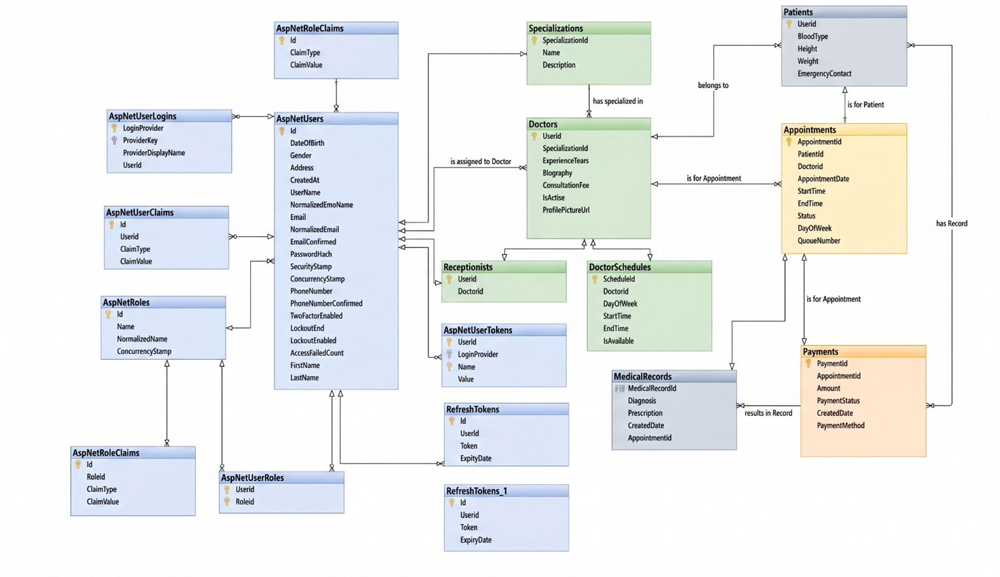

# 🏥 Hospital Appointment & Patient Management System

A scalable and secure **Hospital Management System** built using ASP.NET Web API following **Clean Architecture principles**.  
The system streamlines hospital operations including appointment booking, patient management, doctor schedules, and administrative control.

---

## 📌 Project Overview

This system allows patients to book appointments with doctors, doctors to manage their schedules and medical records, and receptionists and admins to manage hospital operations efficiently.

It is designed with separation of concerns, scalability, and maintainability in mind using Clean Architecture and modern backend best practices.

---

## 👥 System Roles

### 🧑‍💼 1. Admin
The system administrator has full control over the platform.

**Responsibilities:**
- Create doctor accounts
- Create receptionist accounts
- Manage medical specializations
- View analytics dashboard

---

### 👨‍⚕️ 2. Doctor
Doctors manage their patients and medical data.

**Features:**
- View patients who booked appointments
- Create medical records for patients
- Upload and update profile picture
- Manage and update personal profile

---

### 🧑‍🦱 3. Patient
Patients are the end users of the system.

**Features:**
- Register and login to the system
- Browse doctors and filter by specialization
- View doctor profiles
- View doctor schedules
- Book appointments
- Choose payment method:
  - Pay at hospital
  - Visa payment
  - Wallet payment
- Manage and update personal profile

---

### 🧑‍💻 4. Receptionist
Receptionists assist doctors in managing appointments.

**Features:**
- Assigned to a specific doctor
- View all appointments for assigned doctor
- Update appointment status (Complete / Cancel)
- Manage and update personal profile

---

## ⚙️ Tech Stack

- **Backend:** ASP.NET Web API
- **Architecture:** Clean Architecture
- **ORM:** Entity Framework Core
- **Database:** SQL Server
- **Authentication:** JWT + ASP.NET Identity
- **Design Patterns:**
  - Repository Pattern
  - Unit of Work
  - Service Layer Pattern
- **Validation:** FluentValidation
- **Database Configuration:** Fluent API
- **Email Service:** SendGrid (OTP Email Verification)

---

## 📂 Architecture Overview

The project follows Clean Architecture:

Presentation Layer (API Controllers)

↓

Application Layer (Services, DTOs, Business Logic)

↓

Domain Layer (Entities, Core Models)

↓

Infrastructure Layer (EF Core, Identity, External Services)

---

## 📊 Database Design

ERD (Entity Relationship Diagram):

---

## 🔐 Authentication & Security

- JWT-based authentication
- Role-based authorization (Admin, Doctor, Patient, Receptionist)
- Secure password hashing via Identity
- Email verification using OTP (SendGrid)

---

## 🚀 Key Features

- Role-based system (4 roles)
- Appointment booking system
- Doctor schedule management
- Patient medical records
- Secure authentication system
- Analytics dashboard for admins
- Modular and scalable architecture

---

## 📌 Future Improvements

- Real-time chat between doctor and patient
- Video consultation integration
- AI-powered appointment suggestions
- Mobile application (Flutter)
- Notifications system (Push & SMS)
- Advanced reporting dashboard

---

## 🧑‍💻 Author

Yousef Ahmed Fawzy

Developed as backend project using ASP.NET Web API and Clean Architecture principles.

---

## 📄 License

This project is for educational and portfolio purposes.
The project follows Clean Architecture:

